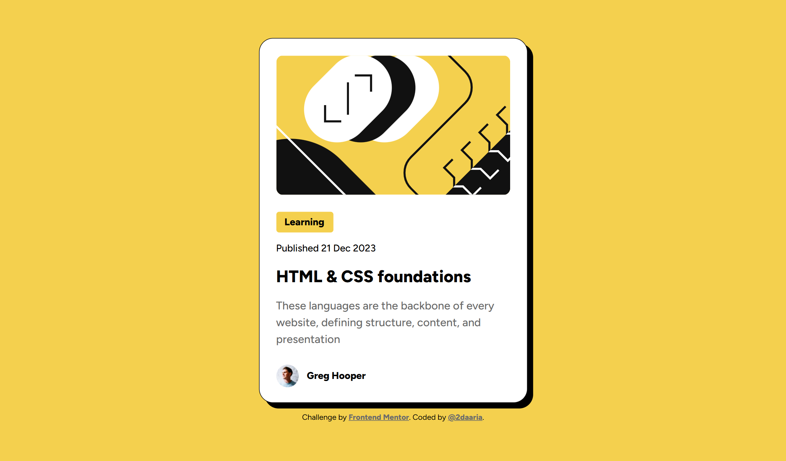

# Frontend Mentor - Blog preview card solution

This is a solution to the [Blog preview card challenge on Frontend Mentor](https://www.frontendmentor.io/challenges/blog-preview-card-ckPaj01IcS). Frontend Mentor challenges help you improve your coding skills by building realistic projects. 

## Screenshot

## Links

- Solution URL: [Blog preview card](https://github.com/2daaria/Blog-preview-card)
- Live Site URL: [Blog preview card](https://2daaria.github.io/Blog-preview-card/)

### Built with

- Semantic HTML5 markup
- CSS custom properties
- Flexbox
